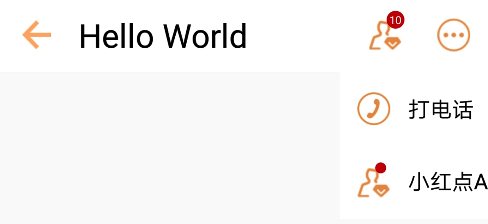

# JToolBar
自定义标题栏，满足日常开发需求，开发者可以通过实现不同接口来实现水平扩展

## MenuAction
    通过实现MenuAction，实现右边Menu菜单的自定义，如果Menu菜单超过2个JToolBar会自动收缩起来，通过点击更多按钮可以展开。JToolBar框架中，默认提供了实现好的2中Menu（IconMenuAction、RedDotMeunAction）
### 使用方法
    RedDotMenuAction redDotMenuActionA = (RedDotMenuAction) mJToolBar.addMenuAction(new RedDotMenuAction(this,RedDotMenuAction.RedDotType.Number,R.drawable.icon_user,"小红点A"));
    redDotMenuActionA.updateRedDotNumber(10);
    redDotMenuActionA.setOnMenuActionLinstener(new MenuActionListener(){
            @Override
            public void onClick(View v) {
                super.onClick(v);
                Toast.makeText(MainActivity.this,"A",Toast.LENGTH_SHORT).show();
            }
    });

## ContentAction
    通过实现ContentAction，实现标题栏正文部分的自定义与扩展。默认提供了BackAndTitleContentAction
### 使用方法
    BackAndTitleContentAction backAndTitleContentAction = (BackAndTitleContentAction) mJToolBar.setContentAction(new BackAndTitleContentAction(this));
    backAndTitleContentAction.setNavigationIcon(R.drawable.icon_back);
    backAndTitleContentAction.setTitle("Hello World");
    backAndTitleContentAction.setNavigationOnClickListener(new View.OnClickListener() {
             @Override
              public void onClick(View v) {
                  Toast.makeText(MainActivity.this,"Back",Toast.LENGTH_SHORT).show();
              }
    });

PS:具体使用方法请参考App项目下面的MainActivity.

